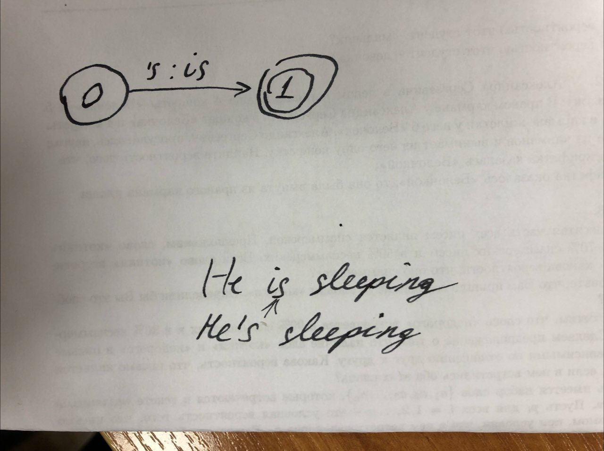
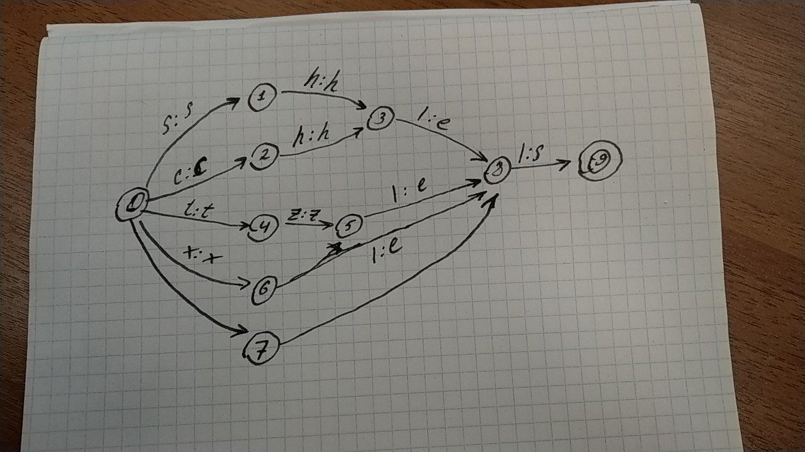

Task1


Task2 

He's sleeping = he is sleeping, *it's OK*

He's slept = He has slept. He is slept *is NOT OK*

Task3 -- A, B

Task4 -- B, D

Task5 
 

```
func=input('Hi I"m pluralization func, feed me one english word you know: ')
l= ['sh','ch','s','x','z'] 
for _ in l:
    if func.endswith(_):
            func=func+'e'            
func= func+'s'
print ('Your resuls is:',func)
```
